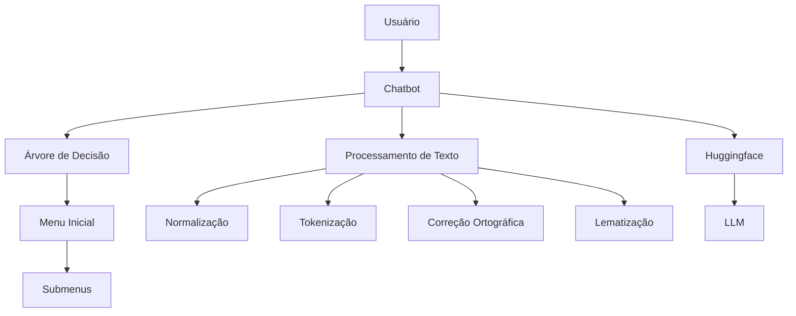
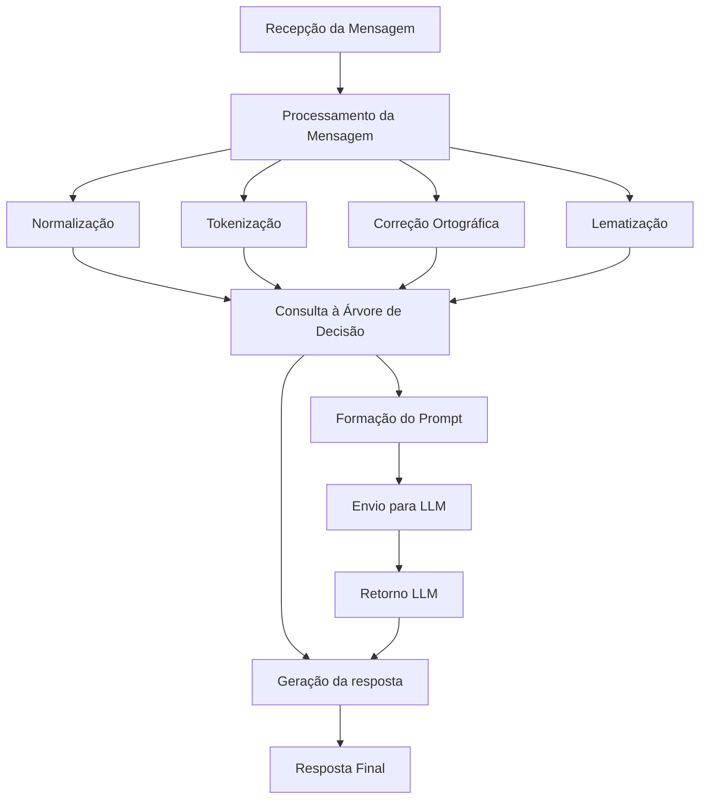

# Projeto Chatbot com Árvore de Decisão

Este projeto é um chatbot baseado em árvore de decisão com processamento de texto avançado, utilizando técnicas de NLP (Processamento de Linguagem Natural) para fornecer respostas mais detalhadas sobre Python. A estrutura do chatbot permite navegação através de menus e submenus dinâmicos, enquanto o processamento de texto inclui normalização, tokenização, correção ortográfica e lematização. Após retornar uma cnsulta fixa pela árvore de decisão, esse texto é convertido em um prompt de entrada para ser enviado a um LLM (simples e gratuito) para simular o uso de uma ferramenta de IA para uma resposta aumentada. 

## Estrutura do Projeto

O projeto é composto por três scripts principais:

- **`decision_tree.py`**: Define a estrutura da árvore de decisão para o chatbot.
- **`text_processing.py`**: Contém funções para processar texto, incluindo normalização, tokenização, correção ortográfica e lematização.
- **`main.py`**: Integra a árvore de decisão com o processamento de texto e fornece a lógica para o chatbot.

## Arquitetura do Projeto

A arquitetura do projeto é composta pelas seguintes partes principais:

- **Árvore de Decisão**: Estrutura hierárquica que organiza o conteúdo do chatbot em menus e submenus.
- **Processamento de Texto**: Funções para manipular e preparar o texto para análise.
- **Lógica do Chatbot**: Integra a árvore de decisão com o processamento de texto e gerencia a interação com o usuário.

### Diagrama de Arquitetura



## Fluxo do Chatbot

1. **Recepção da Mensagem**: O chatbot recebe a mensagem do usuário.
2. **Processamento da Mensagem**: A mensagem é processada para normalização, tokenização, correção ortográfica e lematização.
3. **Consulta à Árvore de Decisão**: Com base na mensagem processada, o chatbot consulta a árvore de decisão para determinar a resposta apropriada.
4. **Geração da Resposta**: O chatbot gera uma resposta com base na árvore de decisão e na mensagem processada.
5. **Resposta ao Usuário**: A resposta é enviada de volta ao usuário.


## Instalação

Para configurar o ambiente e instalar as dependências, siga os passos abaixo:

1. **Clone o Repositório:**

    ```bash
    git clone <URL_DO_REPOSITORIO>
    cd <DIRETORIO_DO_PROJETO>
    ```

2. **Crie e Ative um Ambiente Virtual (opcional, mas recomendado):**

    ```bash
    python -m venv venv
    ```

    Para Unix/MacOS:

    ```bash
    source venv/bin/activate
    ```

    Para Windows:

    ```bash
    venv\Scripts\activate
    ```

3. **Instale as Dependências:**

    ```bash
    pip install -r requirements.txt
    ```

4. **Configure a API Key**: Você precisa de uma conta no Hugging Face para obter uma chave de API. Substitua a chave da API no código da função `query_llm`.

    Encontre a linha a seguir e substitua "SUA_CHAVE_API_AQUI" pela sua chave da API:

    ```python
    headers = {"Authorization": "Bearer SUA_CHAVE_API_AQUI"}
    ```

    A função `query_llm` é usada para consultar o modelo de linguagem e a chave da API deve ser inserida no cabeçalho da requisição.

## Uso

1. **Inicialize o Chatbot**: Execute o script `chatbot.py` a partir da pasta raiz para iniciar o chatbot.

    ```bash
    python chatbot.py
    ```

2. **Interaja com o Chatbot**: Envie mensagens para o chatbot e navegue pelos menus e submenus.

3. **Processamento de Texto**: As mensagens serão processadas automaticamente pelo módulo `text_processing.py`.

## Contribuição

Se você deseja contribuir para o projeto, sinta-se à vontade para enviar pull requests ou abrir issues no repositório. Certifique-se de seguir as diretrizes de contribuição e teste suas alterações antes de enviar.

## Licença

Este projeto está licenciado sob a Licença MIT - veja o arquivo `LICENSE` para mais detalhes.
